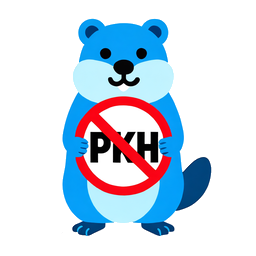

<div align="center">

# Zapret GUI



GUI обертка над [zapret-discord-youtube](https://github.com/Flowseal/zapret-discord-youtube) - инструментом для обхода блокировок интернет-ресурсов.

</div>

## 🚀 Особенности

### Как это работает

Приложение предоставляет графический интерфейс для управления инструментом [zapret-discord-youtube](https://github.com/Flowseal/zapret-discord-youtube), который реализует различные методы обхода блокировок, включая:
- DNS-обфускацию
- HTTP/HTTPS прокси
- SNI-прокси
- UDP туннелирование

Программа автоматически обнаруживает стратегии подключения, запускает и останавливает их через удобный интерфейс, не требуя знания командной строки.

### Ключевые возможности

✅ **Управление стратегиями**
- Автоматическое обнаружение .bat файлов стратегий
- Запуск и остановка стратегий одним кликом
- Сохранение последней использованной стратегии

✅ **Диагностика системы**
- Проверка прав администратора
- Проверка драйвера WinDivert
- Проверка сетевого подключения
- и другое.

✅ **Дополнительные функции**
- Очистка кэша Discord
- Управление режимами IPset (any/none/loaded)
- Game Filter для фильтрации UDP трафика
- Автозапуск при старте системы
- Возможность обновления приложения

## 📋 Требования

- Windows 10/11
- Права администратора для запуска стратегий
- Файлы [zapret-discord-youtube](https://github.com/Flowseal/zapret-discord-youtube)

## 🎯 Использование

1. **Первый запуск**
   - Запустите [`GoZapret.exe`](GoZapret.exe)
   - Укажите путь к папке с файлами [zapret-discord-youtube](https://github.com/Flowseal/zapret-discord-youtube)
   - Нажмите "Сохранить"

2. **Запуск стратегии**
   - Выберите стратегию из выпадающего списка
   - Настройте Game Filter и режим IPset при необходимости
   - Нажмите "Запустить"
   - Для остановки нажмите "Остановить"

3. **Диагностика**
   - Нажмите "Диагностика" для проверки системы
   - Просмотрите результаты проверок

4. **Очистка кэша Discord**
   - Нажмите "Очистить кэш Discord"
   - Подтвердите действие
   - Discord будет закрыт и кэш очищен


## ⚙️ Конфигурация приложения
Конфигурация хранится в JSON файле и ручных изменений не требует:
- Windows: `%APPDATA%\GoZapret\config.json`

Пример конфигурации:
```json
{
  "last_strategy_name": "general",
  "assets_path": "C:\\zapret",
  "auto_start": false,
  "game_filter": true,
  "ipset_mode": "any",
  "version": "1.0.0",
  "updated_at": "2024-01-01T00:00:00Z"
}
```

## 📦 Установка

### Из исходников

```bash
# Клонируйте репозиторий
git clone https://github.com/IProxymate/GoZapret
cd GoZapret

# Установите зависимости
go mod download

# Установите go-winres для обработки ресурсов Windows
go install github.com/tc-hib/go-winres@latest

# Обновите ресурсы Windows (иконки, манифест)
go-winres make

# Соберите приложение
fyne package -os windows -icon ./assets/icon256.png -release -app-id gozapret.com
```

### Готовый бинарник

Скачайте последний релиз из раздела Releases.


## 📝 Лицензия

Этот проект является форком [zapret-discord-youtube](https://github.com/Flowseal/zapret-discord-youtube).

## 🙏 Благодарности

- [zapret-discord-youtube](https://github.com/Flowseal/zapret-discord-youtube) - за удобный запуск различных стратегий
- [zapret](https://github.com/bol-van/zapret) - за основной инструмент обхода блокировок

## 💬 Поддержка

Если у вас возникли проблемы или вопросы:
1. Проверьте раздел Issues
2. Создайте новый issue с подробным описанием проблемы
3. Приложите логи и скриншоты при необходимости
